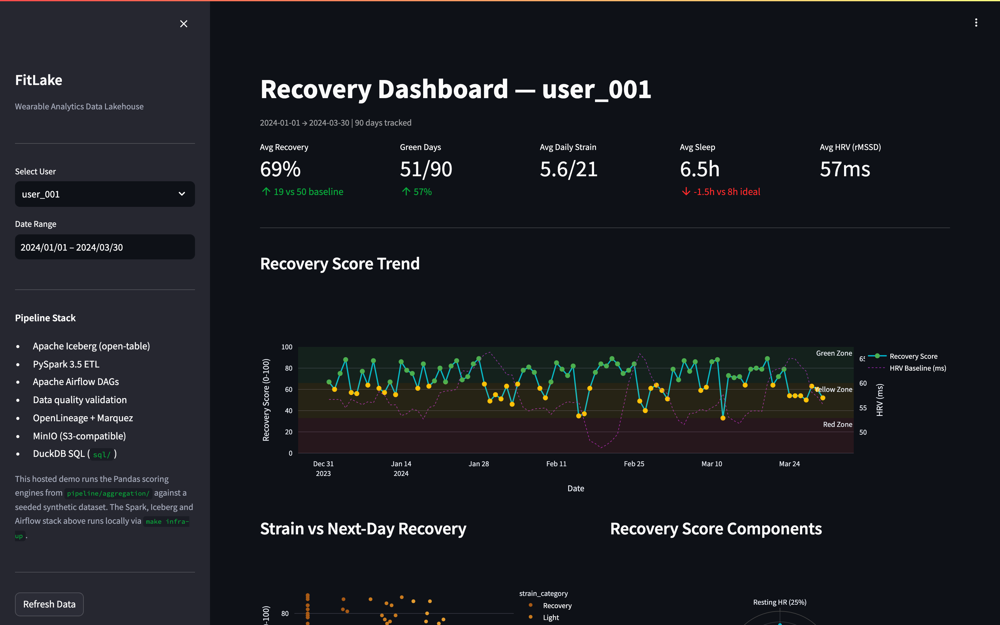
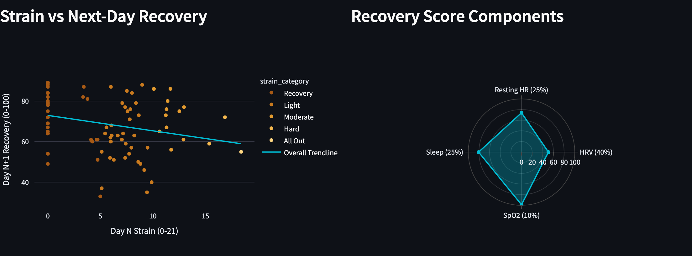
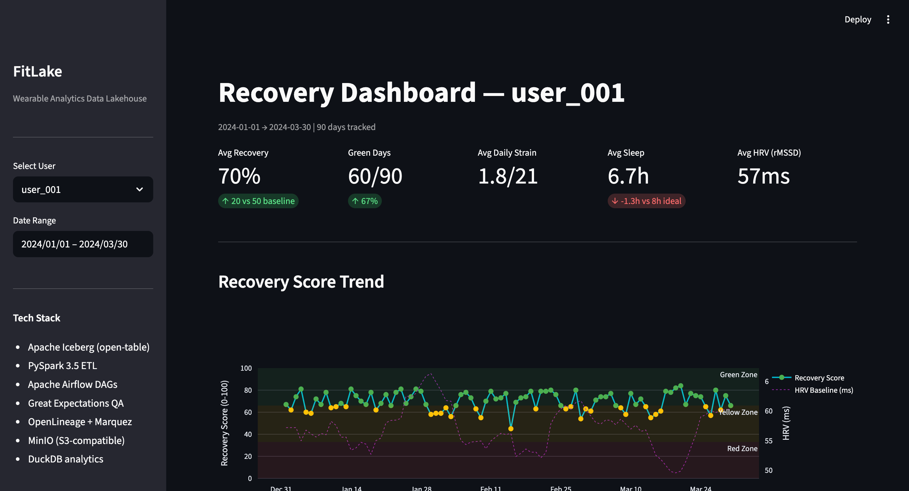
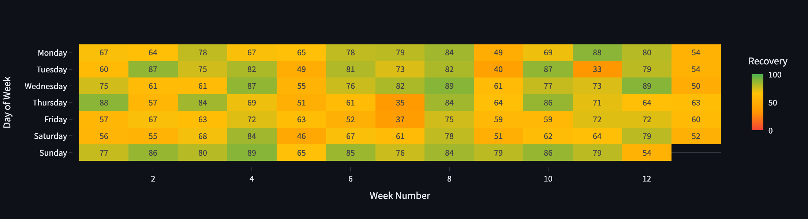
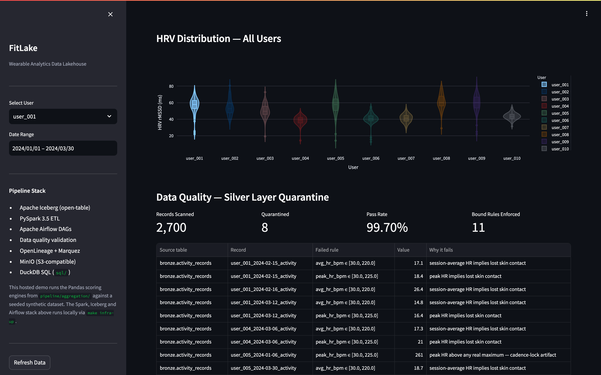

# FitLake — Open-Source Fitness Analytics Data Lakehouse


### ▶ Run it yourself — no install, no download

[](https://codespaces.new/itsameaditya/fitlake?quickstart=1)
[](https://share.streamlit.io/deploy?repository=itsameaditya%2Ffitlake&branch=main&mainModule=analytics%2Fdashboard.py)

- **Codespaces** — opens the dashboard in your browser. The devcontainer installs the dashboard dependencies and starts Streamlit on port 8501.
- **Streamlit Community Cloud** — deploys your own free copy from this repo. Every dashboard pin ships a Python 3.14 wheel, so the default settings build without touching *Advanced settings*.
- **Locally** — clone, install, run: see [Quick Start](#quick-start) below.

The app carries no dataset: it generates a seeded synthetic one on first boot (~1s), so every copy shows the same scores.

Modern fitness wearables generate thousands of daily sensor readings — HRV, sleep stages, heart rate zones, SpO₂ — but raw data alone doesn't answer the question athletes actually care about: **"How recovered am I today, and should I train hard or rest?"**

FitLake is a production-grade data lakehouse that answers this question. It ingests raw wearable sensor data, processes it through a **Bronze → Silver → Gold** medallion architecture using Apache Iceberg, and computes a science-based recovery score modeled after peer-reviewed HRV research. The pipeline includes data quality validation with automatic quarantining, full data lineage tracking, and a Streamlit dashboard that visualizes the results.

**This is not a toy project.** It handles schema evolution (new sensors mid-deployment), idempotent MERGE INTO upserts, distributed Spark computation across 2 workers, Airflow orchestration with conditional branching, and Terraform IaC for AWS deployment — the same patterns used by data platform teams at companies like WHOOP, Oura, and Garmin.

---

## Dashboard











---

## Key Findings from the Pipeline

After processing 900 user-days through the full pipeline ([detailed analysis](docs/INSIGHTS.md)):

| Finding | Data |
|---|---|
| Sleep under 6h drops recovery by **12.5 points** | 58.2 avg vs 70.6 for 7-9h sleepers |
| Poor sleep drops HRV by **4.6 ms** | 45.4ms on <6h vs 50.0ms on 7h+ nights |
| Recovery peaks **Sunday**, bottoms **Saturday** | 16.7-point spread across the week |
| Recovery weeks boost scores by **12.0 points** | 79.0 avg vs 67.1 during training weeks |
| HRV-Recovery correlation: **r = 0.534** | Strongest single predictor |
| Athletes and beginners score the **same** (~70) | 69.8 vs 70.6 — personal baselines normalize fitness level |
| Quality pipeline quarantined **8 bad records** | 0.9% of activity data carried injected sensor faults |

---

## Architecture

```
  Wearable Sensors (HRV · Sleep · HR Zones · SpO₂ · Skin Temp)
                    │ Raw JSON
                    ▼
           MinIO (S3-compatible storage)
                    │ spark-submit
                    ▼
  ┌─────────────────────────────────────────────────────────────┐
  │            Apache Iceberg Lakehouse                          │
  │                                                              │
  │  BRONZE             SILVER              GOLD                 │
  │  ┌──────────┐      ┌──────────┐       ┌────────────────┐   │
  │  │Raw ingest│─────▶│Clean +   │──────▶│Recovery scores │   │
  │  │MERGE INTO│      │Deduplicate│      │Strain scores   │   │
  │  │Schema    │      │Validate  │       │Sleep analytics │   │
  │  │evolution │      │Quarantine│       │Cohort benchmarks│  │
  │  └──────────┘      └──────────┘       └────────────────┘   │
  └─────────────────────────────────────────────────────────────┘
        │                    │                      │
        ▼                    ▼                      ▼
  Bound validation     OpenLineage +          DuckDB + Streamlit
  Data Quality         Marquez Lineage UI     Analytics Dashboard
```

**[Full architecture deep dive →](docs/ARCHITECTURE.md)**

---

## Recovery Score Algorithm

The score answers "How recovered are you?" on a 0–100 scale, using the same physiological principles as commercial wearables:

```
Recovery = HRV Score × 0.40        ← rMSSD vs personal 7-day rolling baseline (z-score sigmoid)
         + Resting HR Score × 0.25 ← lower RHR vs baseline = better recovery
         + Sleep Performance × 0.25 ← duration × architecture × efficiency
         + SpO₂ Score × 0.10       ← blood oxygen penalty below 95%
```

The critical design choice: **personal rolling baselines, not population norms.** A 40ms HRV is excellent for a beginner (their baseline is 35ms) but poor for an athlete (baseline 90ms). This is why athletes and beginners in our dataset both average ~70 recovery despite having vastly different absolute HRV values.

```
Green  ≥ 66  → Well-recovered. Train hard.
Yellow 33–65 → Moderate recovery. Go light.
Red    < 33  → Rest day.
```

**[Algorithm math in detail →](docs/ARCHITECTURE.md#recovery-score-algorithm--mathematical-detail)**

---

## Quick Start

### Local (no Docker, 3 commands)

```bash
git clone https://github.com/itsameaditya/fitlake.git && cd fitlake
pip install -r analytics/requirements.txt
make generate-data        # 10 users × 90 days → data/raw/
make run-local            # Recovery scores + strain + sleep analytics → data/output/
make dashboard-local      # http://localhost:8501
```

`make generate-data` is optional — the dashboard generates the dataset on
first run if `data/raw/` is empty.

### Full Stack (Docker)

```bash
make infra-up             # Spark (master + 2 workers), MinIO, Airflow, Marquez
make run-pipeline         # Full E2E: generate → bronze → silver → gold

# UIs:
# http://localhost:8080  — Spark cluster
# http://localhost:8081  — Airflow DAGs (admin/admin)
# http://localhost:3000  — Data lineage graph (Marquez)
# http://localhost:9001  — MinIO object storage console
# http://localhost:8501  — Analytics dashboard
```

### Run Tests

```bash
pip install pytest pytest-cov
pytest tests/ -v                    # 44 tests, 0.4 seconds
pytest tests/ --cov=pipeline        # Coverage report
```

---

## What This Project Demonstrates

| Skill | Where It's Shown |
|---|---|
| **Apache Iceberg** | MERGE INTO upserts, schema evolution, time travel, snapshot management, hidden partitioning → `spark/jobs/` |
| **PySpark** | Distributed ETL across 2 workers, DataFrame API, Spark SQL, window functions → `spark/jobs/` |
| **SQL** | Complex analytics: window functions, CTEs, correlated subqueries, time travel → `sql/analytics_queries.sql` |
| **Python** | Data generation, scoring algorithms, type hints, dataclasses → `pipeline/aggregation/` |
| **Data modeling** | Medallion architecture, star schema Gold layer, quarantine pattern → `spark/jobs/` |
| **Apache Airflow** | TaskGroups, BranchPythonOperator, SparkSubmitOperator, OpenLineage → `airflow/dags/` |
| **Data quality** | Physiological bound validation, quarantine pattern, JSON quality report → `quality/` |
| **Data lineage** | OpenLineage events → Marquez, automatic from Spark listener → `spark/conf/` |
| **AWS** | S3, EMR Serverless, IAM roles → `infrastructure/terraform/` |
| **Container orchestration** | Docker Compose with 10 services, health checks, dependency ordering → `docker-compose.yml` |
| **IaC** | Terraform for S3 buckets + EMR Serverless application → `infrastructure/terraform/` |
| **Testing** | 44 unit tests, parametrized, fixtures, edge cases, CI integration → `tests/` |
| **CI/CD** | GitHub Actions: lint, test, data-gen smoke test, Docker build → `.github/workflows/` |
| **Data visualization** | Plotly charts: line, scatter+OLS, radar, stacked bar, violin, heatmap → `analytics/dashboard.py` |

---

## Project Structure

```
fitlake/
├── data/generate_data.py              # Synthetic wearable data (10 users × 90 days)
├── pipeline/aggregation/
│   ├── recovery_score.py              # Recovery score algorithm (the analytical core)
│   ├── strain_calculator.py           # HR zone → 0-21 strain score
│   └── sleep_analyzer.py             # Sleep debt, consistency, quality tier
├── spark/jobs/
│   ├── bronze_ingestion.py            # Raw JSON → Iceberg Bronze (MERGE INTO)
│   ├── silver_transformation.py       # Dedup, validate, quarantine bad records
│   └── gold_aggregation.py           # Recovery/strain/sleep → Gold tables
├── airflow/dags/fitlake_pipeline.py   # Full orchestration DAG
├── quality/run_checks.py              # Data quality validation
├── analytics/dashboard.py             # Streamlit dashboard (7 chart types)
├── sql/analytics_queries.sql          # Gold layer SQL (8 analytics queries)
├── tests/                             # 44 unit tests
├── infrastructure/terraform/          # AWS S3 + EMR Serverless
├── docker-compose.yml                 # 10-service local stack
├── docs/
│   ├── ARCHITECTURE.md                # Deep dive: pipeline, algorithm math, design
│   ├── INSIGHTS.md                    # Data findings with real numbers
│   └── DESIGN_DECISIONS.md            # Why each technology was chosen
└── Makefile                           # One-command operations
```

---

## Tech Stack

| Layer | Technology | Why This One |
|---|---|---|
| Lakehouse format | Apache Iceberg 1.5 | Engine-agnostic, schema evolution, time travel ([details](docs/DESIGN_DECISIONS.md#1-apache-iceberg-over-delta-lake-or-hudi)) |
| Distributed compute | Apache Spark 3.5 (PySpark) | Industry standard for batch ETL at scale |
| Object storage | MinIO (local) / AWS S3 (cloud) | Production-identical S3 API, zero code changes ([details](docs/DESIGN_DECISIONS.md#3-minio-over-localstack-for-s3-emulation)) |
| Cloud compute | AWS EMR Serverless | No cluster management, pay-per-second ([details](docs/DESIGN_DECISIONS.md#10-terraform-with-emr-serverless-over-eks)) |
| Orchestration | Apache Airflow 2.9 | TaskGroups, branching, Spark integration ([details](docs/DESIGN_DECISIONS.md#7-airflow-over-prefect-for-orchestration)) |
| Data quality | Explicit bound assertions (Pandas) | Quarantine pattern, not silent drops ([details](docs/DESIGN_DECISIONS.md#6-quarantine-table-over-silent-drops)) |
| Data lineage | OpenLineage + Marquez | Automatic from Spark listener, zero code changes |
| Analytics engine | DuckDB | Free, Iceberg-native, Snowflake-compatible SQL ([details](docs/DESIGN_DECISIONS.md#2-duckdb-over-snowflake-for-local-analytics)) |
| Dashboard | Streamlit + Plotly | Interactive, Python-native, 7 chart types |
| IaC | Terraform | S3 + EMR Serverless in one `terraform apply` |
| CI/CD | GitHub Actions | Lint + test + data-gen smoke test + Docker build |

**[Why each technology was chosen →](docs/DESIGN_DECISIONS.md)**

---

## Cloud Deployment

```bash
cd infrastructure/terraform
terraform init && terraform apply       # Creates S3 buckets + EMR Serverless app

aws emr-serverless start-job-run \
  --application-id <emr_app_id> \
  --execution-role-arn <role_arn> \
  --job-driver '{
    "sparkSubmit": {
      "entryPoint": "s3://fitlake-warehouse/jobs/gold_aggregation.py",
      "sparkSubmitParameters": "--packages org.apache.iceberg:iceberg-spark-runtime-3.5_2.12:1.5.2"
    }
  }'
```

---

## Further Reading

- **[Architecture Deep Dive](docs/ARCHITECTURE.md)** — Pipeline flow, recovery score math, schema evolution, quarantine pattern
- **[Data Insights](docs/INSIGHTS.md)** — Findings with real numbers from 900 user-days of data
- **[Design Decisions](docs/DESIGN_DECISIONS.md)** — Why Iceberg over Delta Lake, DuckDB over Snowflake, and 8 more decisions

### Development Approach

This project was built with AI-assisted development (Claude) as a force multiplier — used for boilerplate scaffolding, test generation, and documentation drafting. All architecture decisions, algorithm design, and data analysis were my own. I used AI the same way I'd use Stack Overflow or documentation: as a tool to move faster, not as a substitute for understanding the code.

### References

- Kiviniemi et al. (2007). *Individual-based control of endurance training intensity.*
- Plews et al. (2013). *HRV as a means of individual-based monitoring of aerobic fitness.*
- Flatt & Esco (2016). *Evaluating the agreement between morning and training HRV.*
- Apache Iceberg: [iceberg.apache.org](https://iceberg.apache.org)
- OpenLineage: [openlineage.io](https://openlineage.io)
